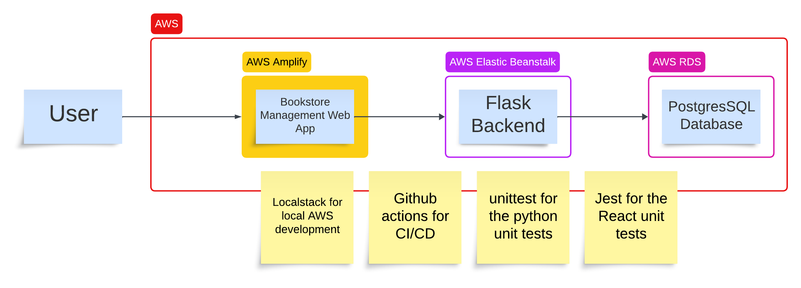

# Bookstore Management System
The Bookstore Management System is designed to showcase the integration of various technologies for building a web application

## Overview
It consists of the following components:

Backend API (Python Flask + Postgres): Implements CRUD (Create, Read, Update, Delete) operations for managing books. Utilizes PostgresSQL for data storage, demonstrating the integration of Flask with a NoSQL database.

Frontend Application (React): Provides a user-friendly interface for browsing and managing books. Interacts with the Flask backend via RESTful API to fetch and update data.

This POC was developed do demonstrate the CI/CD Github actions working together with the following AWS Services: 
1. AWS Elastic Beanstalk for Flask
2. AWS RDS for Postgress
3. AWS Amplify for the React web app
4. Local Stack was used for AWS local development
